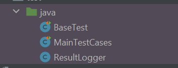
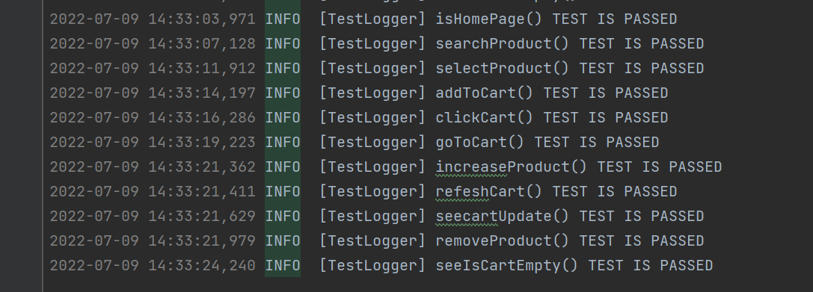

# Selenium Web Automation Project.

- ### The project is in Java language.
- ### Project is Maven project.
- ### Selenium, JUnit,Log4J and Bonigarcia WebDriverManager libraries are used.
- ### The project complies OOP principles and Page Object Pattern is used.

## Project Document.

## Project Design.

- #### In this project, the page object pattern was used, each parameter of the website objectified.
    
      Web Site = "https://www.kitapyurdu.com/"
    
      Web Site Object:

        - HomePage(Anasayfa)
        - ProductsPage(Ürünlerin Sayfası)
        - ProductDetailPage(Ürün Detay Sayfası)
        - CartPage(Sepet Sayfası)
      Test Log Class:
        - TestLogger
        - ResultLogger(test)

      Test:
        - BaseTest(Test'i Setupladığımız kısım)
        - MainTestCases(Test'in tüm adımlarını koşturduğumuz kısım)

  

      

  

- #### BasePage Class ---- extend ----> Sub Class
      
        Ancestor Class:
            " BasePage "
 
        Sub Class:
            " HomePage, ProductsPage, ProductDetailPage, CartPage "
 
        Logger Class:
            TestLogger <--- confgurated ----> log4j.xml

        BaseTest Test Class ---- extend -----> Sub Test Class // ResultLogger ---- extendwith---> BaseTest

          Ancestor Test Class:
            BaseTest

          Sub Test Class:
           MainTestCases

- Encapsulation and Inheritence principles used this project from Object Oriented Programing.

###         Test Object CLasses
    
- ####        BasePage Methods
           - find()-------------> This method find element by locator.
           - findAllProduct() ---> This method find all elements all page and add to a Web Element List by locator.
           - isDisplayedMethod() ----> This method is boolean method,its checking if we are on the page and send true or false.
           - clickElm() ---------------> This method Click located element ( buton search box vs).
           - enterKey() -----------------> This method  send keys to located element.
           - waitMethod() -----------------> This method is waited driver.
           - closePopUp() -------------------> This method close the pop-up
           - randomSelect() -------------------> This method Use Random Class, generate random number and by this random number 
                                                    calls page element from among the listed web page elements.
            
- ####        Sub Classes Methods
        *  Not [ Subs Class inheritence BasPage qualification and method's.]

        *  HomePage Class Methods
           Homepage extend BasePage Methods and it has a few methods.
           - isHomePage() -----> This method is boolean method and checking is driver on homepage ?.
           - search() -----------> This method send keys to searchbox and search products in website.
           - isProductAddedCart()---> This method Check cart and look for product added to cart.
           - goToCart() --------------> This method driver go to the cart.

        *  ProductsPage Class Methods
            ProductPage extend BasePage and it has a few methods.
            - selectProduct() ----- > This method select random product in products page.
            - isOnProductsPage() -----> This method look for driver is in products page.

        *  ProductDetailPage Class Methods
            ProductPage extend BasePage and it has a few methods.
            - isProductDetailPage()  -----> This method is boolean method look for driver is in product detail page; send true or false.
            - addToCart() ------------------> This method driver added product in cart.
          
        *  CartPage Class Methods
            ProductPage extend BasePage and it has a few methods.
            - clickCart() ------> This method driver click cart.
            - increaseProduct() ----> This method add one more product in basket.
            - refeshCart() -----------> This method refesh the cart.
            - seeUpdate() ---------------> This method look Update pop-up if driver see Update message send true or false.
            - removeProduct() --------------> This method remove products in cart.
            - seeEmptyCart() -----------------> This method look for cart, Is cart empty or not empty ? 

- ####        Log Class Methods
        
        *  TestLogger Class Methods
            TestLogger configurated "log4j.xml" confuguration.
            - info() ----> This method send test info.
            - warn() ------> This method send warn.
            - error() ---------> This method send message if happened eror while test running.

###       Test Class 
        
- ####        BaseTest
          This class consists of Base Test steps.
              BaseTest Steps
               - @BeforeAll ---> Its Junits  notification, works before the test starts.
                 - setUp() ------> this method create driver, setup web driver manager, driver goes to website and make web site options.
               
               - @BeforeEach ---> Its Junits notification, works throughout the test.
                 - DuringWork() ----> this method during test spirint, its run the installers and create page object.

               - @AfterAll ------> Its Junits notification , Its works when the  test spirint is finished 
                  tearDown() -------> this method driver exits.

- ####      MainTestCases
          * In this class test runs occur here
             - isHomePage() -------> this step checks driver on the home page.
             - searchProduct() ----> this step Send search Key words after then search product and control the search.
             - selectProduct() ----> this step Select random product and control is driver in productspage ? 
             - addToCart() --------> this step Add product in cart and check product added to cart.
             - clickCart() --------> this step Click cart.
             - goToCart()  --------> this step driver goes basket.
             - increaseProduct() --> this step increase product in basket.
             - refeshCart() -------> this step Refesh the cart.
             - seecartUpdate() ----> this step Driver check Update Pop-Up message.
             - removeProduct() ----> this step remove product in basket.
             - seeIsCartEmpty() ---> this step control basket is Cart empty?.
- ####      ResultLogger
          * In this class implemented testwatcher api for logging
              This methods in test run, refer to test is test Succesful or Failed ?
             - testSuccessful() ---> get message when test succesful
             - testFailed() --------->  get message when test failed 

#### Logs
  
> 
#### TestRun Image
>
